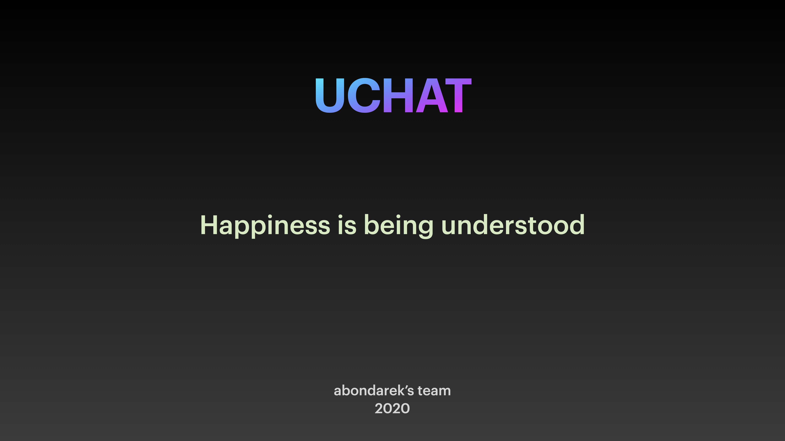

# UChat
Client-Server messenger on C.

## Technologies

Sockets

Threads

GTK

JSON

SQLite3

## Usage

1. Start the Server

2. Launch Client

3. Create User

4. Start to conversation

## Contributing
Catch your feedbacks with pleasure :)

## License
[UCode]

## Screens

 
 
 
